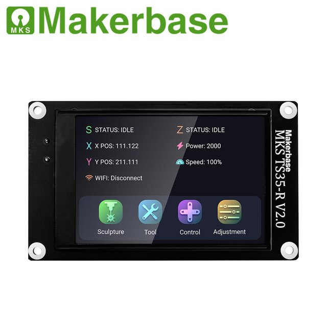
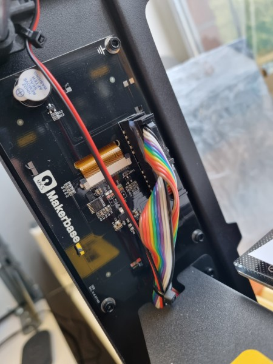
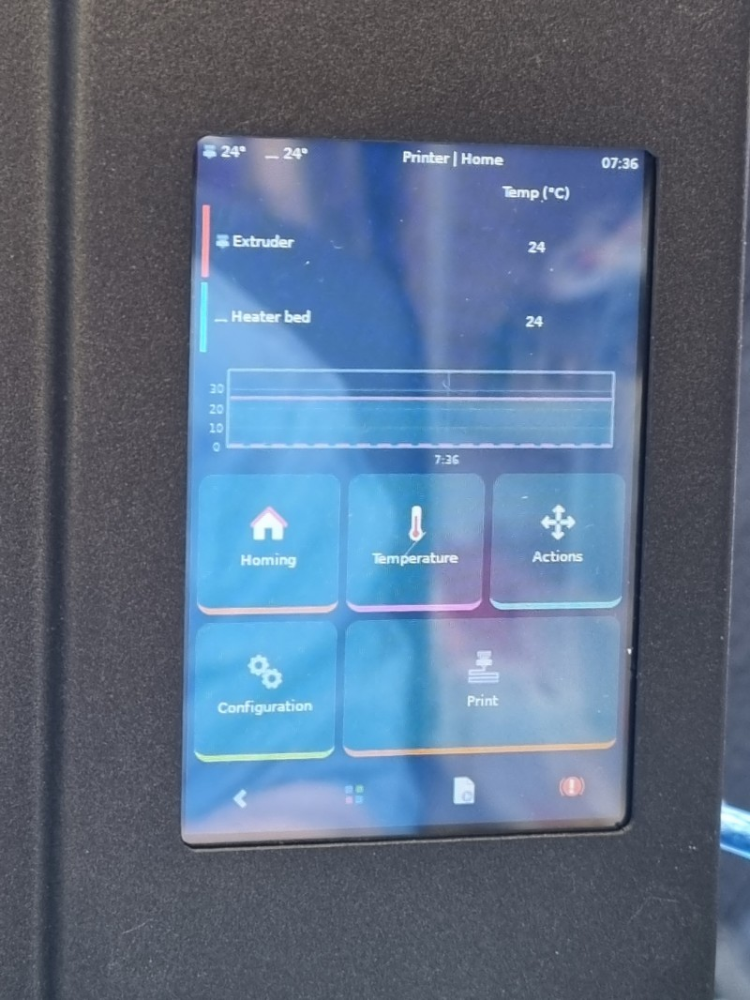

# Flyingbear GHOST6 и Klipperscreen на оригинальном экране

3D-принтер Flyingbear GHOST6 построен с использованием 3.5" TFT жк-дисплея с резистивным сенсором прикосновений MKS TS35-R V2.0.

 

В отличие от раннего собрата GHOST5, в данном принтере дисплей подключается к основной плате двумя десятиконтактными шлейфами с разъёмами типа IDC.
Используется распространённая среди 3D-принтеров цоколёвка EXP1-EXP2, известная с RepRapDiscount GLCD 128*64 и символьных ЖКИ

TFT-дисплей в интерьере




## Подключение MKS TS35 к RaspberryPi и запуск Klipperscreen

На момент написания руководства цены одноплатных компьютеров RaspberryPi сохраняются спекулятивно высокими, и наиболее популярным SBC для установки Klipper на Flyingbeag GHOST6 является компьютер *Orangepi 3 LTS*. Однако, при наличии в запасах RaspberryPi (а также RaspiCam), использование "малинки" по-прежнему актуально.

Основной процесс подключения Klipperscreen на RaspberryPi был расписан здесь 
https://github.com/willngton/3DPrinterConfig/blob/main/mks_ts35/mks_ts35_guide_archived.md

В оригинальном описании присутствуют неточности из-за опечаток, мигрирующих из источника в источник,
отличия конфигурации экрана и устаревания информации.
Данное руководство призвано исправить вышеупомянутые ошибки.


*Убедитесь, что установлены klipper, moonraker, fluidd/mainsail и klipperscreen*

### 1. Электрическое подключение.

**ВНИМАНИЕ!** Нумерация контактов в разъёмах IDC-10M, распаянных на плате, НЕ СОВПАДАЕТ с традиционной, принятой для шлейфов 
и определяемой ключом на ответной части IDC10-F.
Далее в приведённой таблице используется именно "неправильная" нумерация. 

Сверяйте с иллюстрацией, и дважды перепроверяйте по шинам питания, особенно, если не используете готовые наборы DUPONT, 
а делаете самодельный кабель IDC-10x2->BLD40.

Расположение подключаемых пинов


Таблица соединений
| EXP1 | цепь      | GPIO   | RPI |
|:----:|-----------|--------|:---:|
| 1    | BEEP      | nc     | nc  |
| 2    | BTN_ENC   | nc     | nc  |
| 3    | LCD_BLK   | GPIO18 | 12  |
| 4    | LCD_RST   | GPIO25 | 22  |
| 5    | TOUCH_LCD |  GPIO7 | 26  |
| 6    | TOUCH_INT | GPIO23 | 16  |
| 7    | LCD_CS    | GPIO8  | 24  |
| 8    | LCD_RS    | GPIO24 | 18  |
| 9    | GND       | GND    | 14  |
| 10   | BOARD_5V  | 5V     | 4   |


| EXP2 | цепь      | GPIO   | RPI |
|:----:|-----------|--------|:---:|
| 1    | MISO      | GPIO9  | 21  |
| 2    | SCK       | GPIO11 | 23  |
| 3    | BTN_EN1   | nc     | nc  |
| 4    | nc        | nc     | nc  |
| 5    | BTN_EN2   | nc     | nc  |
| 6    | MOSI      | GPIO10 | 19  |
| 7    | nc        | nc     | nc  |
| 8    | RESET     | nc     | nc  |
| 9    | GND       | GND    | 25  |
| 10   | BOARD_3.3 | nc     | nc  |


Выводы *GPIO14* и *GPIO15* сохранены незадействованными для подключения через UART1 управляющей платы (Klipper-MCU) 


### 2. Правка /boot/config.txt

```console
$ sudoedit /boot/config.txt
```

Убедитесь, что включён оверлей spi:

```
dtparam=spi=on
```

Вышеупомянутое руководство упоминает файл https://github.com/willngton/3DPrinterConfig/blob/main/mks_ts35/config.txt как образец.
В файле есть ошибки, игнорируйте все строки, начиная с 72:

```
######  MKS TS35
...
```

Сверяться с этим файлом нужно в том случае, если ставите клиппер на чистый Raspbian, в образах FluidPi/MainsailOS лишние оверлеи отключены.


**САМАЯ ВАЖНАЯ ЧАСТЬ:**


добавить в конце /boot/config.txt параметры экранного буфера и настройки его трансляции через fbcp

```###### MKS TS35
hdmi_force_hotplug=1
hdmi_cvt=320 480 60 5 0 0 0
hdmi_group=2
#hdmi_mode=1
hdmi_mode=87
display_rotate=0x10002

# MKS TS35 Rotated 270 (for fit on Two Trees Bluer)
dtparam=spi=on
dtoverlay=tinylcd35,rotate=0,speed=36000000,touch,touchgpio=23,fps=10 
```
Образец [config.txt](boot/config.txt)

### 3. Замена оверлея tinylcd35
~~Взять оверлей здесь: https://drive.google.com/file/d/1BjEr-IkiOSmBhzX91KLA9PSWtEvyiL5W/view?usp=sharing
$ sudo cp tinylcd25.dtbo.2 /boot/overlays/tinylcd35.dtbo~~

Информация устарела, на форуме RaspberryPi упоминается, что с октября 2020г правильный оверлей уже включён в состав свежих образов.


### 4. Установка fbcp

```console
$ sudo apt-get install cmake xserver-xorg-input-evdev  xserver-xorg-video-fbdev
$ cd ~
$ sudo git clone https://github.com/tasanakorn/rpi-fbcp
$ cd rpi-fbcp/
$ sudo mkdir build
$ cd build
$ sudo cmake ..
$ sudo make
$ sudo install fbcp /usr/local/bin/fbcp
$ cd ../..

```

// вряд-ли для ВСЕХ команд сборки необходимы root-права, надо проверить, хватит ли первого и последнего sudo

### 5. добавка fbcp в автозапуск

создать юнит для fbcp

```console
$ sudoedit /etc/systemd/system/fbcp.service
```

```service 
[Unit]
Description=fbcp
After=KlipperScreen.service
StartLimitIntervalSec=0
[Service]
Type=simple
Restart=always
RestartSec=1
User=root
ExecStart=/usr/local/bin/fbcp

[Install]
WantedBy=multi-user.target
```

разрешить запуск сервиса

```console
$ sudo systemctl enable fbcp.service
```

### 6. Установка поддержки сенсорного ввода 

```console
$ sudo apt-get install xserver-xorg-input-evdev
```

### 7. Перезагрузить RaspberryPi

**ВНИМАНИЕ** Все дальнейшие действия предполагают, что к одноплатнику НЕ ПОДКЛЮЧЕНЫ HDMI-монитор, клавиатура и мышь. Выполняйте все действия через ssh-соединение.
<!-- Пользователи windows наверняка к моменту подключения klipperscreen уже познакомились с PuTTY, линуксоиды без меня знают и про ssh, и про иксы, и про DISPLAY=:0 :) -->

```console
$ sudo reboot
```

После перезагрузки должен отобразиться KlipperScreen


Если на данном этапе вы видите [консоль с приглашением залогиниться](images/console.jpg) - поздравляю, вы, как и я, забыли установить klipperscreen (а заодно и не подтянулся X-сервер)
Запускаем KIAUH и доустанавливаем. (инструкция по KIAUH выходит за рамки данного руководства)

## Калибровка сенсорного экрана
Базовая (без выполнения калибровки) точность определения координат резистивного экрана, по субъективным оценкам, около 5%.
Это означает, что большие контролы клипперскрина можно нажимать без риска ложных срабатываний, но работа с экранной клавиатурой будет вызвыать сложности.
Улучшить соответствие экранных координат и координат сенсора можно при помощи калибровки.


### 8. Установка утилиты калибровки 
```console 
$ sudo apt install xinput-calibrator
```

### 9. Выполнение калибровки

Узнаём id устройства ввода, в нашем примере получили id=6:
```console 
$ DISPLAY=:0 xinput_calibrator --list

Device "ADS7846 Touchscreen" id=6
```

Вызываем утилиту калибровки, указав ранее полученный id
```console
DISPLAY=:0 xinput_calibrator -v --device 6
```

[место для картинки]
Поочерёдно стилусом касаемся 4х указанных точек, после чего получаем вот такой результат:

```console
DEBUG: XInputExtension version is 2.3
DEBUG: Skipping virtual master devices and devices without axis valuators.
DEBUG: Selected device: ADS7846 Touchscreen
...
DEBUG: Successfully applied axis calibration.
        --> Making the calibration permanent <--
DEBUG: Found that 'ADS7846 Touchscreen' is a sysfs name.
  copy the snippet below into '/etc/X11/xorg.conf.d/99-calibration.conf' (/usr/share/X11/xorg.conf.d/ in some distro's)
Section "InputClass"
        Identifier      "calibration"
        MatchProduct    "ADS7846 Touchscreen"
        Option  "Calibration"   "165 3859 157 3848"
        Option  "SwapAxes"      "0"
EndSection
```

Забираем в буфер обмена предложенный сниппет - строки Section "InputClass" ... EndSection включительно.

### 10. Сохранение результата калибровки
```console
$ sudo mkdir -p /etc/X11/xorg.conf.d/
$ sudoedit /etc/X11/xorg.conf.d/99-calibration.conf
```

В открывшийся текстовый редактор вставляем строки из буфера обмена:
```console
Section "InputClass"
        Identifier      "calibration"
        MatchProduct    "ADS7846 Touchscreen"
        Option  "Calibration"   "165 3859 157 3848"
        Option  "SwapAxes"      "0"
EndSection
```

