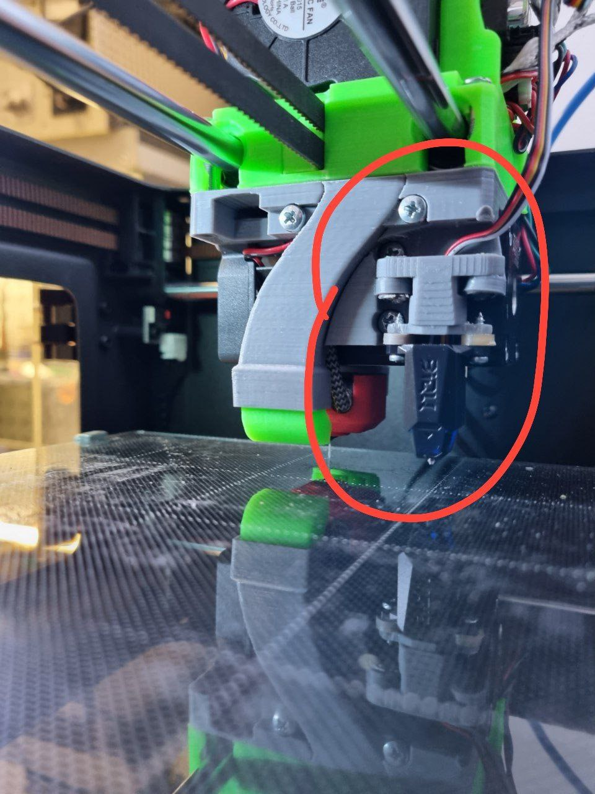

Конфигурация для крепления сенсора BLTouch или BIQU Microprobe на голову Karas5015.

ВНИМАНИЕ! Конфигурация приведена в качестве примера. Раскомментируйте секцию в соответствии с используемым зондом. 
Может потребоваться коррекция номеров пинов в зависимости от подключения, и подстройка координат сетки и винтов стола.

Расположение сенсора - сзади/справа относительно сопла

